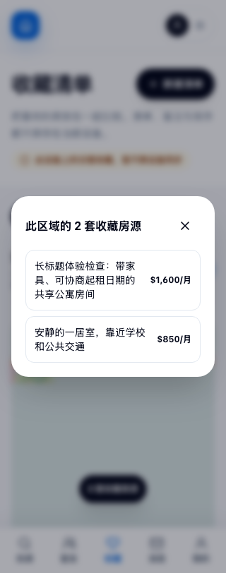
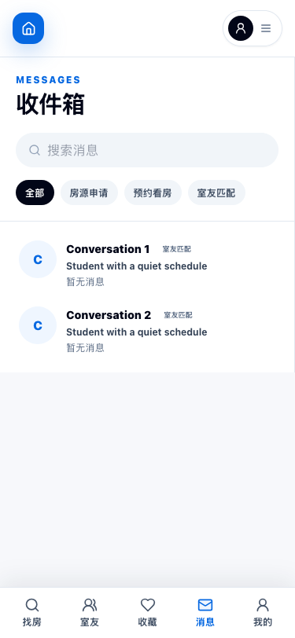
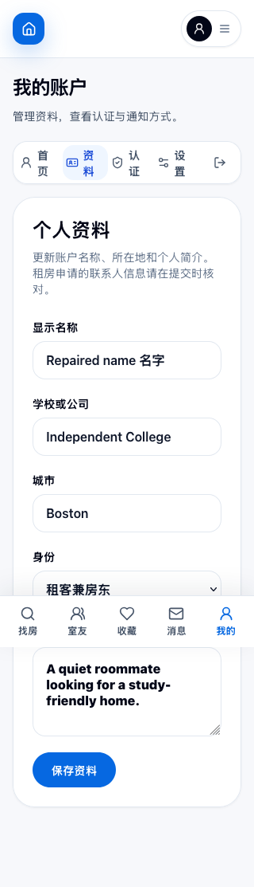

# Third review evidence

The fresh third-review cohort started from commit
`6e79733dbad38adb6800e462b62e18f3e6da7704`. Reviewers formed initial conclusions from source
and newly written probes before reading earlier audits, previous reviewers' findings, PR descriptions,
or old browser evidence. Coordination and repair work started after those conclusions were recorded.
Repair verification is separately identified; it does not replace the initial independent inspection.

The JSON records are preserved reviewer output. Their original local evidence paths identify the
review environment; the selected files here make the main observations available with the source.
All accounts, messages, listings, photographs, and session strings in browser fixtures are synthetic.
These records do not establish a working public deployment or successful production provider access.

- [Final root local gates and exact source hashes](root-local-validation.json)

## Security and operation evidence

- [Independent security findings and repairs](security.json)
- [Initial independent operations findings](operations-initial.json)
- [Operations repair verification and limits](operations-repair-verification.json)
- [Catalog capacity measurements](capacity-repair-verification.json)
- [Separate read-only driver repair verification](driver-repair-verification.json)
- [Exact installed runtime wire records](driver-final-runtime.jsonl)
- [Exact installed runtime TLS records](driver-final-tls.jsonl)

The driver verifier was appointed after initial findings. Its review supplies independent repair
verification; it is not represented as a fourth initial third-review inspection. The initial
operations report is unchanged. The artifact hygiene check found no live credentials or real personal records; the verifier's local
absolute repository path was redacted before publication. The API TLS key/certificate fixture is
synthetic, restricted to a localhost transport test, and has no provider/account authority.

Failed native-driver and terminal transaction-shutdown probes are
retained with their limits, and are not counted as passing checks. Final root gates and service CI
are recorded in the consolidated review.

## Browser evidence

- [Reviewer findings, fixes, coverage and limitations](usability.json)
- [Initial guest checks](browser-initial.json)
- [Initial saved-map and activity failure observations](browser-first-journeys.json)
- [Initial mobile Inbox failure](browser-inbox-mobile-back.json)
- [Private journeys across three browser engines](browser-private-and-engines.json)
- [First rebuilt repair checks](browser-repair-verification.json)
- [Offline draft recovery, account race isolation and synthetic touch selection](browser-offline-and-race.json)
- [Final Inbox Back/Forward, thread selection and composer geometry](browser-inbox-history-final.json)
- [Final visible map-choice dialog](browser-map-dialog-final.json)

The first rebuilt repair checks intentionally retain an Inbox browser-Back failure. This exposed a
cached-route selection mutation after the original back-arrow defect was repaired. The subsequent
source refinement removed that mutation; the final Inbox record verifies the full sequence in
Chromium, Firefox, and WebKit. Failed intermediary checks are not counted as final passes.

Narrow viewport checks use actual configured browser viewports. Tests using
`document.documentElement.style.zoom = '2'` are **CSS zoom**, not native browser zoom. Browser-engine
emulation does not prove software keyboard behavior, real iOS safe-area insets, background recovery,
screen-reader use, or provider performance. Headless WebKit's default Tab behavior also depends on
full keyboard access settings; no background interactive control received focus in the recorded
modal checks.

Selected final screenshots:

