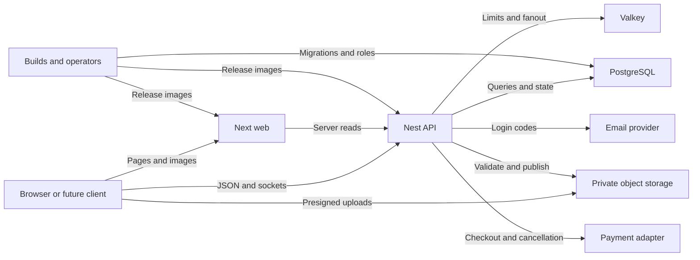

## Executive summary

The user confirmed that the immediate deliverable is a demo, followed later by possible Apple,
Android and WeChat distributions. For a controlled demo, the main residual risks are JavaScript-readable
bearer sessions, previously uploaded images that retain metadata, resource exhaustion, and accidental
use of development behavior with real data. Internet deployment raises the importance of credential
custody, provider trust, shared rate limiting and recovery. Current controls include database-backed
authorization, administrator step-up, bounded image validation and immutable sanitized derivatives,
production TLS/configuration gates, nonce-based script CSP and container isolation. This is a model
of the reviewed source, not production certification or proof that every abuse path is exploitable.

## Scope and assumptions

- **Validated usage:** demo first; mobile stores and a possible WeChat miniapp are later delivery
  targets. The preceding deployment check-in and the user's demo-first response establish this scope.
- **In scope:** `app/`, `components/`, `lib/`, `middleware.ts`, `next.config.mjs`, `api/src/`,
  `api/prisma/`, Docker/Compose configuration, `tools/` and `.github/`. Model the final reviewed
  source, including fixes; keep tests/examples distinct from runtime.
- **Ranking assumption:** the immediate demo runs on a controlled host/private LAN, mainly with
  synthetic records and one API process. The default Compose bindings support this assumption;
  a public deployment, actual personal records and multiple API instances are **conditional**.
- **Conditional integrations:** real email, hosted payment adapter, managed PostgreSQL/Valkey,
  S3-compatible storage and HTTPS ingress require operator configuration and acceptance tests.
  Their actual policies, accounts, quotas, logging and backups were not inspected.
- **Local storage restriction:** the archived MinIO CE source build has known high-severity 2026
  advisories and is restricted to synthetic localhost use, with both ports forced to loopback.
  Phone LAN browsing reads images through the API; direct phone uploads and shared/public storage
  require a maintained patched S3 provider. TLS alone does not repair these upstream defects.
- **Out of scope:** signed native/mobile packages, WeChat identity binding, store approval, real
  payment-provider internals, infrastructure penetration testing and a compromised user's OS/browser.
  No native or miniapp implementation is asserted (`docs/platform-delivery.md`).

Open questions that would materially change ranking: Will the demo be internet accessible? Will
real users supply personal records or preexisting photos? What ingress, instance count, provider
accounts, retention rules and recovery objectives will production use? These remain explicit
conditions rather than assumptions of completed deployment. Validation results belong in
`docs/security-review-2026-09-30.md`; this document does not substitute for those results.

## System model

### Primary components

- **Browser/Next client and server:** responsive React UI, client bearer API calls, server-side API
  reads and stock-image optimization; first-party media bypasses the optimizer to enforce revocation.
  Production middleware generates per-request script
  nonces and prevents document caching (`middleware.ts`, `lib/content-security-policy.ts`,
  `next.config.mjs`). Normal access tokens persist in `localStorage`; administrator step-up tokens
  use tab `sessionStorage` through the administrator UI (`lib/auth-session.ts`, `lib/admin-step-up.ts`).
- **Nest API:** `/api/v1` HTTP routes and the `/roommate-messaging` Socket.IO namespace. Bootstrap
  checks production configuration, installs CORS/security headers, validates DTOs and configures
  proxy trust (`api/src/main.ts`, `api/src/app.module.ts`).
- **PostgreSQL/Prisma:** users, profiles, login-code hashes, invites, audit events, listing/media
  state, applications, private messages and demo ledger state (`api/prisma/schema.prisma`).
- **Valkey:** production shared authentication rate-limit state and optional/distributed messaging
  rate limiting/fan-out (`api/src/auth/valkey-rate-limit-store.ts`,
  `api/src/roommate-conversations/socket-adapter.ts`).
- **Private object storage:** presigned browser PUTs, bounded API reads, image decoding and frozen
  publication objects (`api/src/listing-media/listing-media-storage.ts`,
  `api/src/listing-media/listing-media.service.ts`).
- **External providers:** Resend email and an operator-selected HTTPS payment adapter. Development
  uses console email and simulated payments; production omits `DemoPaymentsModule`
  (`api/src/email/email-sender.ts`, `api/src/payments/payment-commands.ts`, `api/src/app.module.ts`).
- **Separate tooling zone:** dependency/build/CI, migration jobs and privileged operator CLIs.
  These are not browser-accessible application features (`.github/workflows/verify.yml`,
  `tools/`, `api/src/operations/`).

### Data flows and trust boundaries

- **B01 Browser → Next:** HTML, scripts, navigation and stock-image requests over local HTTP or conditional
  public HTTPS. Nonce CSP, framing restrictions and optimizer denial of API image paths constrain active content;
  browser storage remains readable by executed same-origin JavaScript. Anchors: `middleware.ts`,
  `next.config.mjs`, `lib/auth-session.ts`.
- **B02 Browser/Next → API:** JSON fields, bearer tokens and Socket.IO handshake authentication.
  Production requires an HTTPS web origin; CORS does not replace authorization. DTO allowlists,
  bounded HS256 token verification, database role/identity lookup, owner/member checks and fresh
  admin step-up enforce application access. Next's internal container HTTP hop assumes a trusted
  application network. Anchors: `api/src/main.ts`, `api/src/auth/authenticated-user.service.ts`,
  `api/src/auth/admin-step-up.guard.ts`, `compose.production.yml`.
- **B03 API → PostgreSQL:** account/contact data, code hashes, messages, decisions and audit records
  through Prisma. Production requires exactly one `sslmode=require` and `sslaccept=strict`; local
  demo PostgreSQL uses loopback/development credentials. Transactions and database constraints protect
  state transitions. Anchors: `api/src/config/env.ts`, `api/prisma/schema.prisma`, `api/prisma/migrations/`.
- **B04 Browser → Object storage:** attacker-controlled image bytes through an owner-authorized,
  expiring presigned PUT. Initialization declares MIME, size and checksum; these declarations are
  independently checked before publication. Upload origin/CORS must match operator configuration.
  Anchors: `api/src/listing-media/listing-media.service.ts`, `tools/production-config.mjs`.
- **B05 API → Object storage:** credentials and object bytes over production HTTPS; private-bucket
  policy remains an operator control. Streaming reads stop at 10 MiB and 15 seconds; decoder input
  is capped at 40 million pixels. Three finalizations per process are admitted before buffering;
  validated, metadata-stripped derivatives fit a 2560 px longest edge without enlargement and enter
  a separate immutable key namespace. Published
  reads recheck listing approval and byte integrity. Anchors: `listing-media-storage.ts`,
  `listing-media-validation.ts`, `listing-media.service.ts` under `api/src/listing-media/`.
  The archived demo CE backend cannot be trusted against untrusted direct clients: disclosed access
  keys can reach known signature bypasses. Its mandatory loopback boundary and synthetic-only usage
  are compensating isolation, not an upstream patch (`Dockerfile.demo-storage`, `docker-compose.yml`,
  SEC-011 in `docs/security-review-2026-09-30.md`).
- **B06 API → Valkey:** hashed authentication identifiers, limiter counters and private event fan-out.
  Production requires `rediss`. Authentication limiter-store errors fail closed in production;
  messaging can fall back to local limiting/fan-out and reports degraded readiness. Anchors:
  `api/src/auth/auth-rate-limit.ts`, `api/src/roommate-conversations/roommate-message-rate-limit.ts`,
  `api/src/health/health.service.ts`.
- **B07 API → Email/payment providers:** recipient email/code or application/actor identifiers,
  idempotency keys and API credentials over HTTPS. Email has a five-second total retry budget;
  payment requests have an eight-second deadline and reject redirects. Response status/checkout URL
  shape is validated, but provider identity, checkout-domain policy and financial correctness remain
  external trust. Anchors: `api/src/email/email-sender.ts`, `api/src/payments/payment-commands.ts`.
- **B08 Developers/operators → Builds/runtime/database:** source, dependency code, images, secrets,
  migrations and role/invite mutations. CI pins actions, uses read-only repository permissions and
  does not persist checkout credentials; production app processes run as `node` with read-only roots
  and dropped capabilities. Operator CLI identity depends on trusted host access, not merely its
  supplied actor-email argument. Anchors: `.github/workflows/verify.yml`, `Dockerfile.api`,
  `Dockerfile.web`, `compose.production.yml`, `api/src/operations/admin-roles.service.ts`.

#### Diagram

## Assets and security objectives

| Asset | Why it matters | Security objective (C/I/A) |
| --- | --- | --- |
| Bearer tokens, OTP/JWT/hash secrets and provider/database credentials | Account takeover, privileged access and service impersonation | C, I |
| User/profile contact data, roommate attributes, application dates/member snapshots | Identifies people and their housing activity; schema includes email, WeChat and Instagram fields | C, I |
| Roommate/deal message bodies and viewing requests | Private communication can contain personal details | C, I, A |
| Listing images, stored object keys and review/publication state | Can reveal location metadata or publish unreviewed/substituted content | C, I |
| Application decisions, payment-operation receipts and demo ledger entries | Prevent unauthorized decisions, duplicate operations and misleading payment state | I, A |
| PostgreSQL, decoding capacity, Valkey and provider quotas | Keep login, uploads and messages available; avoid storage/email cost abuse | A |
| Audit history, migrations, backups and release artifacts | Attribution, recovery and confidence in the deployed code | C, I, A |

Data anchors: `api/prisma/schema.prisma` models `Profile`, `RentalApplication`, `RoommateMessage`,
`DealMessage`, `ListingMedia`, `AuditEvent`, `PaymentOperation` and `DemoLedgerEntry`. This is not a
claim that the app stores card credentials or identity documents; those fields were not established
in the reviewed schema.

## Attacker model

### Capabilities

A LAN demo participant can send direct HTTP requests, alter browser state, choose upload bytes,
replay requests and operate multiple clients. If publicly exposed, anonymous internet attackers gain
these network capabilities; authenticated users can substitute resource IDs, send messages, create
their own listings and repeat expensive operations. Repository readers can inspect public source
and history. A malicious dependency or compromised operator is a separate higher-privilege actor.

### Non-capabilities

Ordinary users cannot select the API's storage/payment service URL, access server secrets, directly
query PostgreSQL/Valkey, grant themselves database roles, or upload into the frozen-key namespace.
Those require an additional configuration error or privileged compromise. A stored image is not
automatically executable JavaScript; accepted formats exclude SVG/HTML. CORS is not assumed to
prevent a direct API attacker. Provider/host compromise is conditional, not established by source review.

## Entry points and attack surfaces

| Surface | How reached | Trust boundary | Notes | Evidence (repo path / symbol) |
| --- | --- | --- | --- | --- |
| Next pages/image optimizer | Browser HTTP | B01 | Script injection, hydration and remote image fetch | `middleware.ts`; `next.config.mjs` `remotePatterns` |
| Login and administrator step-up | `/auth/email-code`, `/auth/verify-email`, admin step-up routes | B02, B06, B07 | OTP verification, email cost and privileged session | `api/src/auth/auth.controller.ts`; `auth-rate-limit.ts` |
| Profiles/listings/roommates | `/profiles`, `/listings`, `/roommates`, `/roommate-profiles` | B02, B03 | Public discovery differs from account-owned writes | `api/src/marketplace/marketplace.controller.ts`; `api/src/listings/listings.controller.ts` |
| Private applications/messages/teams | Applications, deal threads, roommate conversations/teams | B02, B03 | IDs, ownership, idempotency and lifecycle transitions | `api/src/applications/applications.service.ts`; `api/src/deal-threads/deal-threads.service.ts` |
| Realtime connection/events | `/roommate-messaging` handshake | B02, B06 | User room assignment and disconnect on token expiry | `api/src/roommate-conversations/roommate-conversations.gateway.ts` |
| Upload/finalize/retry/public content/review | Listing media routes and presigned PUT | B04, B05 | Binary parsers, resource budgets and publication visibility | `api/src/listing-media/listing-media.controller.ts`; `listing-media.service.ts` |
| Admin moderation and trust queues | Guarded admin routes | B02, B03 | Role checked from DB; writes require step-up | `api/src/listings/admin-listings.controller.ts`; `api/src/auth/admin-step-up.guard.ts` |
| Checkout/cancellation/provider responses | Payment/applications routes and outbound HTTPS | B02, B07 | External state trust, authorized actors and retries | `api/src/payments/payments.service.ts`; `payment-commands.ts` |
| Legacy reads and health endpoints | Legacy housing/trips/groups; `/health`, `/ready` | B02, B03, B06 | Retired production reads; readiness can be degraded with HTTP 200 | `api/src/http/legacy-listings-retirement.ts`; `api/src/health/health.service.ts` |
| Setup/build/release/admin CLI | Trusted developer/operator terminal and CI | B08 | Subprocesses, secrets, migrations and role mutation | `tools/local-setup.mjs`; `.github/workflows/verify.yml`; `api/src/operations/` |

## Top abuse paths

1. **TM-001 — Steal a session:** obtain same-origin script execution through a future injection or
   compromised permitted script → read the normal `localStorage` token or active admin tab token →
   replay API requests as the victim. CSP reduces injection opportunities; storage is still readable.
2. **TM-002 — Abuse authentication:** enumerate emails/devices or distribute OTP requests across
   clients → exploit weak ingress proxy trust, exhausted provider quotas or accidentally public
   development-code behavior → deny login or acquire a victim session. Production rate limits,
   purpose-bound hashed codes and step-up constrain this path.
3. **TM-003 — Cross account boundaries:** substitute listing/application/thread/member IDs → reach
   an unguarded legacy surface or a future missing owner predicate → read another user's activity or
   change decisions. Current owner/member checks and production legacy retirement block known paths.
4. **TM-004 — Exhaust upload capacity:** authenticate → create own listings/uploads → repeatedly
   finalize high-pixel valid images or saturate public image reads → consume decoder memory, CPU,
   storage/bandwidth and shared API capacity despite per-request limits.
5. **TM-005 — Expose or replace image content:** retrieve an old published original containing GPS
   metadata, or attempt overwrite/replay around upload finalization → expose private location details
   or substitute reviewed content. New frozen derivatives block substitution; old images need rollout work.
6. **TM-006 — Abuse provider trust:** a compromised/misconfigured email/payment provider receives
   secrets/data or returns deceptive checkout/payment state → login or transaction integrity fails.
   This needs provider/configuration compromise; ordinary clients cannot choose those server URLs.
7. **TM-007 — Exploit deployment degradation:** publicly expose development infrastructure, weaken
   TLS/proxy trust, or operate multiple instances during Valkey failure → leak data, bypass globally
   shared accounting, or lose availability. Exposing archived demo storage additionally enables its
   known high authentication/integrity/DoS defects; HTTPS does not fix them. Mandatory loopback
   reduces remote reachability; a maintained storage provider is required for shared uploads.
   Missing restore capability can turn disruption into loss.
8. **TM-008 — Compromise delivery or reuse old keys:** execute a malicious dependency/release change
   on a privileged host, or discover a historically committed key that remains active → obtain
   credentials or alter released code. Historical generated/test-key presence alone does not prove
   a live provider credential compromise.

## Threat model table

Priorities below apply to the controlled demo assumption. The indicated internet/real-data conditions
can raise priority before public launch; they are not confirmed vulnerabilities or completed mitigations.

| Threat ID | Threat source | Prerequisites | Threat action | Impact | Impacted assets | Existing controls (evidence) | Gaps | Recommended mitigations | Detection ideas | Likelihood | Impact severity | Priority |
| --- | --- | --- | --- | --- | --- | --- | --- | --- | --- | --- | --- | --- |
| TM-001 | Script attacker/dependency | Same-origin script execution or compromised browser context | Read/replay bearer token | Victim account/message access | Sessions, PII, private messages | Nonce CSP (`middleware.ts`); HS256/max age/current DB roles (`authenticated-user.service.ts`); admin step-up | Normal JWT persists for up to seven days; admin `sessionStorage` is also JS-readable; no demonstrated per-session revocation | Before real-user internet launch, evaluate a BFF/HttpOnly session with CSRF controls and revocation; native clients need platform credential storage | CSP reports if configured; unusual session use; admin step-up/write anomalies | Low: no working injection identified; rises with external scripts/public data | High: valid token carries victim access | medium |
| TM-002 | Anonymous/authenticated caller | Network access; production uplift depends on real email/ingress | Flood send/verify, spoof effective identity or expose dev codes | Login denial or account takeover | OTPs, accounts, email quota | Purpose-bound code hashes/attempt limits (`auth.service.ts`); multidimensional limiter fail-closed (`auth-rate-limit.ts`); production email gate | Actual proxy header policy/provider quotas unverified; demo codes are intentionally visible outside production | Keep demos isolated and synthetic; test ingress `TRUSTED_PROXY_HOPS`; alert on send/verify and provider budget spikes | 429/503 rates, rejected code attempts, email spend | Low: layered limits constrain demo abuse; public development-mode exposure changes ranking | High with actual accounts; low for disposable demo identities | medium |
| TM-003 | Authenticated user | Reachable route and a missing/regressed authorization predicate, or sensitive legacy demo records | Substitute resource IDs; invoke legacy reads | Cross-account disclosure or unauthorized decision | Messages, applications, listing state | Owned/member queries (`applications.service.ts`, `deal-threads.service.ts`); approved public media; legacy trips/groups 410 in production | Future routes/retries must preserve actor binding; legacy development datasets are not user-isolated | Retain negative ownership/idempotency tests; do not import real private records into legacy demo tables | Denied cross-resource requests and anomalous ID traversal | Low: reviewed current paths contain controls | High if another account's private records or decisions are reached | low |
| TM-004 | Uploading user or public image client | Own listing/upload access; or public content route | Saturate image decode/read work and object creation | Slow/OOM API; storage and bandwidth cost | API capacity, private storage, availability | 10 MiB streaming ceiling/15-second read deadline (`listing-media-storage.ts`); 40M pixels; three active finalizations before buffering (`listing-media.service.ts`) | Admission is per process; no demonstrated per-user storage quota or load-tested container memory budget; public reads also consume resources | Before public scale, load-test worst-case images, set memory/CPU limits and per-account quotas; rate-limit/cache public reads at ingress | Active finalizations, 503/retry rate, RSS/CPU, object count and egress | Medium: authorized repeats are easy; controls bound individual work | Medium demo outage; higher for shared production capacity | medium |
| TM-005 | Image reader/upload owner | Preexisting metadata-bearing published objects, or attempt to alter an upload key | Read metadata or replace/replay publication bytes | Location disclosure or content-integrity failure | Images, personal location, review decisions | Full decode/rotate/metadata omission (`listing-media-validation.ts`); separate frozen keys/checksums/approval checks (`listing-media.service.ts`) | Old READY/PUBLISHED originals remain unchanged; previously downloaded/cache-held copies cannot be erased | Inventory/reupload/review old images, retire old IDs/keys, purge downstream caches, inspect served metadata and visible content | Unexpected checksum failures, public reads after suspension, metadata inventory | Low for new derivatives; unknown for existing images | High if real GPS/personal metadata exists; low for synthetic imagery | medium |
| TM-006 | Provider or privileged configuration actor | Actual providers enabled and provider/configuration compromise | Capture email codes/credentials or forge checkout/status results | Account or financial-state compromise | Codes, provider keys, payment integrity | HTTPS/no redirects/deadlines/idempotency (`email-sender.ts`, `payment-commands.ts`); authorized payment actor (`payments.service.ts`) | Real provider behavior/reconciliation unverified; checkout hostname not constrained beyond HTTPS/no credentials | Accept-test provider idempotency/cancellation/reconciliation; configure allowed checkout hosts and least-privilege scoped keys before real payments | Provider failures, duplicate receipts, unexpected checkout hosts, reconciliation drift | Low in demo: real payment adapter is not exercised | High only when actual account/payment providers are used | low |
| TM-007 | Network attacker/operator error | Public deployment, bad network/TLS/proxy policy, multiple instances or infrastructure failure | Reach infrastructure, weaken verification or exploit local fallback | Disclosure, availability loss, distributed-limit inconsistency | DB/Valkey/storage credentials and durable records | Strict PostgreSQL TLS and production URL gates (`config/env.ts`, `production-config.mjs`); loopback/isolated containers (`compose.production.yml`); sanitized degraded readiness (`health.service.ts`) | Real ingress/network/IAM, recovery, resource limits and alerts unverified; messaging fallback is intentionally local | Verify public/private boundaries and TLS; alert on degraded readiness body, not only status; test DB/object restores; require shared healthy limits before scaling | Readiness components, DB/Valkey failures, backup/restore age, unusual infrastructure access | Low on single controlled host; rises with internet/multi-instance operation | High with real data or unrecoverable state | medium |
| TM-008 | Dependency/repository/host actor | Malicious build change/host access, or historically exposed key still active | Exfiltrate secrets, impersonate service or alter release | Privileged compromise | Credentials, artifacts, audit integrity | Locked install/audit/pinned read-only actions (`verify.yml`); env/key build exclusion (`.dockerignore`); audited role changes (`admin-roles.service.ts`); local setup refuses remote DB | Historical generated keys remain in Git history; active identity reuse unverified; API image retains development tooling; CI/host trust is external | Classify and rotate any historically active identity; isolate PR/build hosts from deployment secrets; protect required checks; publish immutable images and review updates | Secret scanning/history inventory, dependency audit, unexpected CLI role grants/image changes | Low absent key reuse/build compromise; historical readability alone is insufficient | High if release or production credentials are compromised | medium |

## Criticality calibration

- **critical:** unauthenticated compromise of production signing/DB credentials with broad data
  access; a systemic authorization bypass across real users; arbitrary execution on a privileged
  release host with production secrets. None is certified as an existing exploitable path here.
- **high:** a stolen real administrator session that satisfies step-up; real GPS/message disclosure
  across accounts; forged real payment/refund state accepted from a compromised adapter; direct
  access to archived CE storage with real data, including its known unsigned-upload bypasses.
- **medium:** authorized image processing/cost abuse that disrupts a shared demo; multi-instance
  messaging fallback losing global accounting; metadata-bearing old objects pending inventory.
- **low:** enumeration of already-public approved listing IDs; rejected unsupported upload formats
  without resource impact; historically generated/test keys with no active identity reuse.

The biggest ranking changes are public exposure, actual personal/financial data, multiple API
processes, reuse of historical identities and verified recovery capability. Store packaging does not
remove these backend boundaries; a new client changes token storage and platform identity assumptions.

## Focus paths for security review

| Path | Why it matters | Related Threat IDs |
| --- | --- | --- |
| `lib/auth-session.ts`, `lib/admin-step-up.ts` | JS-readable token storage, identity/expiry and logout handling | TM-001 |
| `middleware.ts`, `lib/content-security-policy.ts`, `next.config.mjs` | Nonces, cache behavior and image-fetch allowlists | TM-001, TM-004 |
| `api/src/auth/authenticated-user.service.ts`, `api/src/auth/optional-auth.guard.ts` | Token algorithm/age, DB identity and current privileges | TM-001, TM-003 |
| `api/src/auth/auth.service.ts`, `api/src/auth/auth-rate-limit.ts` | OTP lifecycle, retry serialization, abuse limits and fail-closed behavior | TM-002 |
| `api/src/applications/applications.service.ts`, `api/src/deal-threads/deal-threads.service.ts` | Actor ownership and idempotency across decisions/conversations | TM-003, TM-006 |
| `api/src/roommate-conversations/roommate-conversations.gateway.ts`, `api/src/roommate-conversations/roommate-message-rate-limit.ts` | Socket expiry, recipient rooms and distributed fallback | TM-001, TM-003, TM-007 |
| `api/src/listing-media/` | Binary decoding, frozen bytes, budgets, metadata and publication checks | TM-004, TM-005 |
| `api/src/payments/`, `api/src/email/email-sender.ts` | Provider credentials, deadlines, redirects and returned state | TM-002, TM-006 |
| `api/src/groups/groups.service.ts`, `api/src/trips/trips.service.ts`, `api/src/http/legacy-listings-retirement.ts` | Unowned legacy surfaces must stay retired for production | TM-003 |
| `api/prisma/schema.prisma`, `api/prisma/migrations/` | Personal data, constraints and durable-state transitions | TM-003, TM-006, TM-007 |
| `api/src/config/env.ts`, `tools/production-config.mjs`, `compose.production.yml` | TLS/network/secret validation and deployment isolation | TM-002, TM-007 |
| `api/src/operations/`, `.github/`, `Dockerfile.api`, `.dockerignore` | Operator authority, supply chain, historical secrets and image contents | TM-008 |

## Notes on use

- This is a source-grounded threat inventory. Controls are identified from code/configuration;
  their presence is not a claim that production providers or infrastructure have been accepted.
- Coverage check: discovered HTTP, realtime, upload, image-optimizer, provider, health, legacy and
  operator surfaces are included; B01–B08 appear in the threats; runtime and build/test zones are
  separated; the user's demo-first/platform clarification and conditional deployment assumptions
  are reflected; material open questions are listed.
- Revisit this model before public access, real payment activation, importing existing imagery,
  adding API instances or introducing native/WeChat clients. Record actual acceptance tests,
  load/resource results, restore drills and incident owners alongside the operational checklist.
