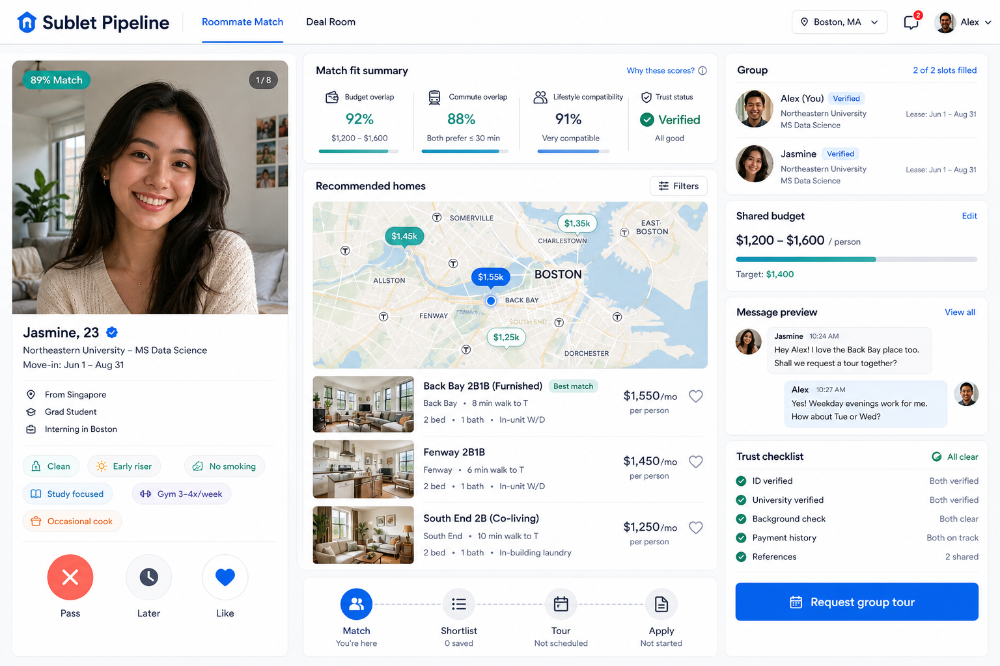

# Roommate-First Commercial Demo Design

## Summary

Build the next version of Sublet Pipeline as a roommate-first commercial demo. The user selected the "front-end commercial demo" implementation scope and the C2 product structure: Tinder-style roommate matching with recommended homes updating alongside the active match.

The demo should feel like a product that could be shown to partners, investors, or early users. It should not pretend to be production-complete backend infrastructure. The frontend should present a complete purchase path: discover a roommate, understand why the match works, see homes the group can rent together, enter a deal room, and request a group tour.

## Confirmed Direction

- Product direction: roommate matching is the primary entry point.
- Commercial path: each roommate card creates or updates a deal room with shared budget, recommended homes, trust status, and a tour/application CTA.
- Reference behavior:
  - Airbnb: date/location/filter feel and trust-oriented booking packaging.
  - Zillow: efficient map/list home comparison and saved homes behavior.
  - Tinder: swipe, pass/later/like, match, and message preview logic.
- Engineering scope: front-end commercial demo first. Do not add complex backend match tables, production chat, payment, or real map provider in this pass.

## Concept Reference

Primary visual reference:

The concept locks the intended desktop structure:

- Top app navigation with compact brand and location/account controls.
- Left roommate swipe card with portrait, match score, verified identity, personal tags, and pass/later/like buttons.
- Center match-fit summary, map-like recommended homes, listing rows, and deal pipeline.
- Right conversion rail with group members, shared budget, message preview, trust checklist, and a strong "Request group tour" CTA.

## Product Structure

### 1. Roommate-First Workspace

The default first screen should be a three-column workspace:

- Left: active roommate deck.
- Center: match-fit summary and recommended homes.
- Right: group/deal conversion rail.

The navigation can still expose Discover, Deal Room, Publish, Trips, and Trust areas, but the primary landing state should make "find roommate first, then find housing together" obvious within five seconds.

### 2. Match Fit

For the active roommate, calculate and display:

- Budget overlap.
- Commute overlap.
- Lifestyle compatibility.
- Trust status.
- Shared target budget.

This can be deterministic demo logic derived from existing roommate/listing data. It should not require a new backend service.

### 3. Recommended Homes

Recommended homes should update when the active roommate changes. They should prioritize:

- Monthly price that fits the combined or per-person budget story.
- Group-suitable tags such as whole apartment, multiple bedrooms, or Group recommendation.
- Commute/transit fit.
- Trust tags such as verified listing, landlord aware, video tour, or first-day protection.

The center panel should keep a map/list comparison feel even if the map remains stylized.

### 4. Deal Room

After Like, the UI should enter a matched/deal-room state:

- Add the active roommate to the group.
- Show group members and shared budget.
- Keep recommended homes visible.
- Show a message preview seeded from the matched roommate.
- Show trust checklist rows.
- Show deal pipeline: Match, Shortlist, Tour, Apply.
- Make "Request group tour" the main CTA.

The CTA can update local state and toast text. It does not need to create real calendar bookings.

### 5. Other Screens

Existing screens should remain available, but can be simplified around the new story:

- Discover: keep Zillow-like search/list/map for users who want to browse homes directly.
- Groups or Deal Room: show the current group, budget, selected recommended homes, and next steps.
- Publish: keep the existing listing demo flow.
- Trips and Trust: keep current operational previews.

## Data And State

Use frontend state for the demo:

- `activeRoommateIndex`
- `likedRoommateIds`
- `skippedRoommateIds`
- `activeDealRoom`
- `savedListingIds`
- `selectedListingId`
- `tourRequested`

Create pure helpers for computed demo data:

- `getBudgetNumber(roommate)`
- `buildMatchFit(roommate, listings, groupMembers)`
- `recommendListingsForRoommate(roommate, listings, groupMembers)`
- `buildDealRoom(roommate, listings, groupMembers)`

The helpers should be easy to test without rendering React.

## Visual System

Use the existing Next.js, Tailwind, shadcn-style components, and lucide-react icons. Preserve the repo's practical product UI direction but make it more commercial:

- Background: cool near-white / light gray.
- Surfaces: white with fine borders and restrained shadows.
- Text: deep navy.
- Primary accent: sky/teal blue.
- Trust accent: green.
- Reject accent: restrained coral/red.
- Radius: 8px for controls and most panels, slightly larger only for large media.
- Density: operational and scannable, not a marketing landing page.

Avoid decorative blobs, one-note purple palettes, beige/cream themes, giant hero sections, nested cards, and in-app tutorial copy.

## Responsive Behavior

- Desktop: three-column workspace.
- Tablet: deck and deal panels stack into two columns where possible.
- Mobile: active roommate card first, then match-fit summary, then recommended homes, then deal CTA. Controls must remain tappable and text must not overflow.

## Testing And Verification

Functional verification:

- Unit-test the match/recommendation helpers.
- Typecheck the web app.
- Build the web app.
- Run browser QA on desktop and mobile viewport.

Visual verification:

- Compare rendered UI against `docs/superpowers/specs/assets/roommate-first-commercial-demo-concept.png`.
- Confirm first viewport clearly communicates roommate-first matching.
- Confirm switching roommate updates match fit and recommended homes.
- Confirm Like creates/updates the deal room.
- Confirm Request group tour changes visible state/toast.
- Confirm no visible text overflow on mobile.

## Out Of Scope

- Production matching backend.
- Real chat.
- Real Stripe payments or escrow.
- Real Mapbox/Google Maps integration.
- Identity provider and moderation provider integrations.
- Admin tooling beyond existing static trust/operations previews.
